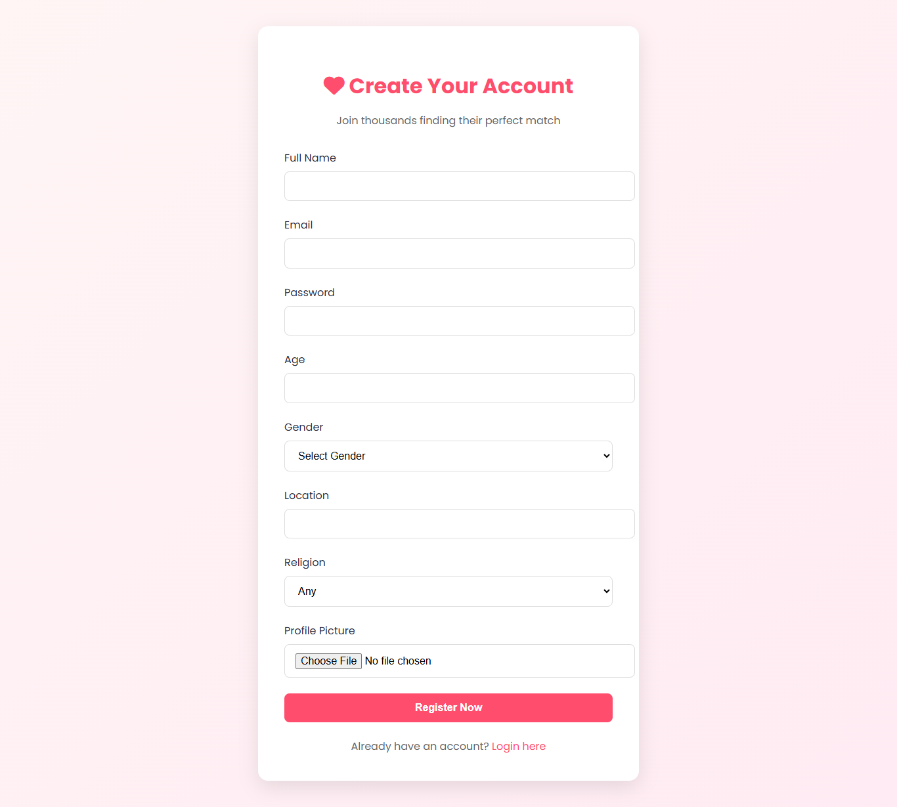

# Matrimony System – MA-CBC-MS

A secure and efficient matrimony web application with multilevel user verification and constraint-based communication. The system ensures only verified users can interact, enhancing trust and safety in online matchmaking.

---

## Features

- ✅ *Multi-Level User Authentication*
  - Government ID verification using OCR
  - Live selfie capture with liveness detection
  - LinkedIn and payslip cross-verification

- 💬 *Constraint-Based Chatting*
  - Age-based restrictions
  - Verified-only messaging
  - Chat request limits and user blocking/reporting

- 📧 *Email Notifications*
  - Alerts on successful uploads and authentications
  - Notifications for new messages and updates

---

## Technologies Used

- *Frontend*: HTML, CSS, JavaScript
- *Backend: Python
- *Database: Oracle
- *OCR & Face Recognition*: Tesseract

---



## Getting Started

### 1. Clone the repository

```bash
git clone https://github.com/your-username/matrimony-system.git
cd matrimony-system
